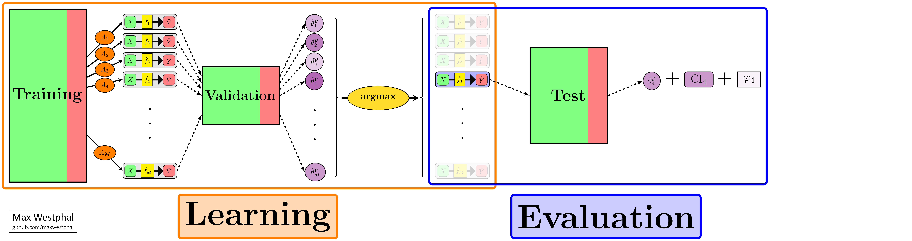
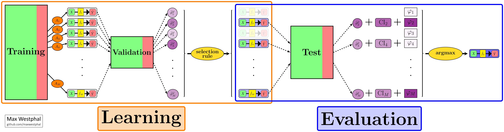

%usepackage_latex()

%% Operators - Start
\newcommand{\pr}{\mathbb{P}}
\newcommand{\E}{\mathbb{E}}
\newcommand{\ND}{\bar{D}}
\newcommand{\boldX}{\mathbf{X_{|1}}}
\newcommand{\boldXnot}{\mathbf{X_{|0}}}
\newcommand{\Xnoi}{X_{|0}}
\newcommand{\X}{X_{|1}}
\newcommand{\hatf}{\hat{f}}
\newcommand{\hatY}{\hat{Y}}
\newcommand{\one}{\mathds{1}}
\newcommand{\setM}{\mathcal{M}}
\newcommand{\setS}{\mathcal{S}}
\newcommand{\setT}{\mathcal{T}}
\newcommand{\setL}{\mathcal{L}}
\newcommand{\setE}{\mathcal{E}}
\newcommand{\setD}{\mathcal{D}}
\newcommand{\setR}{\mathcal{R}}
\newcommand{\setN}{\mathcal{N}}
\newcommand{\RD}{R_D}
\newcommand{\RND}{R_{\ND}}
\newcommand{\za}{z_{1-\alpha}}
\newcommand{\zM}{z_{1-1/2M}}
\newcommand{\asim}{\stackrel{\cdot}{\sim}}
\newcommand{\betahat}{\hat{\beta}}
\newcommand{\thetahat}{\hat{\vartheta}}
\newcommand{\thetatilde}{\tilde{\vartheta}}
\newcommand{\thetan}{\vartheta_0}
\newcommand{\setP}{\mathcal{P}}
\newcommand{\setB}{\mathcal{B}}
\newcommand{\setF}{\mathcal{F}}
\newcommand{\setH}{\mathcal{H}}
\newcommand{\setV}{\mathcal{V}}
\newcommand{\haty}{\hat{y}}
\newcommand{\hatbeta}{\hat{\beta}}
\newcommand{\niton}{\not\owns}
\newcommand{\valest}{ (\thetahat_m(\setV))_{m \in \setM}}
\newcommand{\D}{\mathfrak{D}}
\newcommand{\eps}{\epsilon}

\DeclareMathOperator{\argmax}{argmax}
\DeclareMathOperator{\err}{err}
\DeclareMathOperator{\Err}{Err}
\DeclareMathOperator{\var}{var}
\DeclareMathOperator{\cov}{cov}
\DeclareMathOperator{\Var}{Var}
\DeclareMathOperator{\Cov}{Cov}
\DeclareMathOperator{\corr}{corr}
\DeclareMathOperator{\ROC}{ROC}
\DeclareMathOperator{\AUC}{AUC}
\DeclareMathOperator{\wAUC}{wAUC}
\DeclareMathOperator{\pAUC}{pAUC}
\DeclareMathOperator{\TPF}{TPF}
\DeclareMathOperator{\FPF}{FPF}
\DeclareMathOperator{\FWER}{FWER}
\DeclareMathOperator{\power}{power}
\DeclareMathOperator{\Power}{Power}
\DeclareMathOperator{\CP}{CP}
\DeclareMathOperator{\SE}{SE}
\DeclareMathOperator{\logit}{logit}
\DeclareMathOperator{\diag}{diag}
\DeclareMathOperator{\expo}{exp}
\DeclareMathOperator{\Abb}{Abb}
\DeclareMathOperator{\argmin}{argmin}
\DeclareMathOperator{\acc}{acc}
\DeclareMathOperator{\se}{se}
\DeclareMathOperator{\CI}{CI}
\DeclareMathOperator{\Bin}{Bin}
\DeclareMathOperator{\KL}{KL}
\DeclareMathOperator{\IQR}{IQR}

---

# Introduction 
Prediction models are everywhere. They predict if an email contains spam, forecast tommorrow's stock prices or diagnose if a patient is diseased. Such models take some feature data as input and return a prediction of the target variable. Features could be specific word frequencies, recent market movements or X-ray images. More often than not, machine-learning (ML) algorithms are used to train such models from data. An ML algorithm takes some data, a collection of feature-label pairs, as input and outputs a prediction model. Once a model has been trained it can be employed into practice. Theoretically...

Of course, things are rarely that simple. In practice, it is never known beforehand which algorithm and hyperparameter choices lead to the model with the highest performance. That is why in practice usually many different approaches are (rightly) tried out and compared. Unfortunately, if many such comparisons are conducted it is hard to distinguish between truly good models and a model that only empirically appears to perform well enough. This is in particular true, when the amount of available data is limited. Thus, for serious applications, a rigorous evaluation before implementation in practice becomes is very important. After all, while there are certainly benefits when implementing a good model there are also costs when implementing a bad one.

This document contains the results of an extensive simulation study regarding the selection and evaluation of machine learned prediction models described by **Westphal & Brannath (2019, ICML)**. The main purpose of this document is to act as a supplementary report of results. It shows several additional analyses which could not be included in the recent publication. Moreover, this report may also serve as a starting point for non-technical readers as complex mathematical notation and theoretical details are avoided whenever possible. For more detailed information regarding the employed methods we refer the reader to **Westphal & Brannath (2019, ICML)** and our previous work **Westphal & Brannath (2019, SMMR)**. 

Any question or suggestion regarding this report and our underlying research is very welcomed - feel free to contact me. While the above mentioned publications are joint work with Werner Brannath, I compiled this report on my own and hence I am solely responsible for any potential error. An overview over other projects in the context of model evaluation can be found at https://maxwestphal.github.io/SEPM.PUB/.

## Background

The usual recommendation in applied machine learning is to select a prediction model based on the empirical performance on a hold-out validation set to avoid overfitting to the training data. When computationally feasible, the results of different data splits (learning = training + validation) can be averaged. Such cross-validation and bootstrapping approaches are however not investigated in this study - instead we focus on simple hold-out validation. Once a final model is selected, its performance should be evaluated on a seperate test dataset, as illustrated in the following diagram:

```{r diagram_single, fig.show='hold'}

```

The main goal of this simulation study is to compare this *default* model selection approach with other strategies. In particular, we highlight differences to selecting multiple promising models (based on the validation data) for a simultaneous evaluation on the test data. This novel approach to assess several models at once allows to utilise the test data for model selection. In contrast, model selection and evaluation are usually stricly seperated to avoid selection-induced bias. Our approach involves countering this overoptimism with a particular simultaneous test procedure, the so-called maxT-approach which is based on approximate joint distribution of performance estimates. This expanded machine-learning and evaluation pipeline is shown below.

```{r diagram_multiple, fig.show='hold'}

```

## Setup

In the following, some preliminary steps for for data handling are carried out. In theory, showing these steps makes the whole analysis reproducible. To this end, all simulations need however to be conducted locally first which is very time consuming. For us, this process took roughly 3 months with a 16 core CPU (AMD Ryzen Threadripper 1950X). If you are just interested in the results of the study, feel free to skip this section. 

```{r packages, echo=TRUE, message=FALSE, warning=FALSE, collapse=TRUE}
## load packages:
library(dplyr)
library(tidyr)
library(readr)
library(ggplot2)
library(knitr)
library(rmdformats)
library(DT)
library(SEPM.MLE) 
```

After loading all neccessary packages (assuming they are installed akready), a few global options are set which may alter the appearance of this document.

```{r config, include=TRUE}
## set global options:
config <- list()

## simulation results path (NEEDS TO BE REPLACED!!!):
config$path <- 'E:/DataScience/R/SIM/MLE_SIM/RESULTS'

## enable/disable caching
config$load.cache <- TRUE
config$data.cache <- TRUE
config$figure.cache <- TRUE

## render plots:
config$plot <- TRUE

## plotting options:
config$fig.dpi <- 240
config$fig.size <- 12
config$title.size <- 24
config$text.size <- 18
config$big.cex <- 5
config$small.cex <- 2

## subset data for faster compilation, set to NA for full data analysis:
config$subset.size <- NA

## specify methods to include in certain analysis (must be contained in the data):
config$bias.methods <- c("within1SE", "default")
```

Finally, a few custom objects and functions are defined.

```{r definitions, include=FALSE}
## define colors and plot symbols used for the different methods:
cols <- scales::hue_pal()(25) # scales::show_col(scales::hue_pal()(25))
info <- rbind(c("oracle[learn]", "truly best model", cols[1]),
              c("oracle[train]", "truly best model (before re-training)", cols[21]),
              c("oracle[gamma]", "maximized empirical validation performance + (known) gain due to re-training", cols[24]),
               c("simple", "elastic net model with highest L1 penalty within 1 SE of best validation model", cols[18]),
              c("default", "empirically best validation model", cols[3]),
              c("within1SE", "all models within 1 standard error of best validation model [S.max=sqrt(n.eval)]", cols[9]), 
              c("within1SE[S.max=M]", "all models within 1 SE of best validation model [S.max=M]", cols[11]), 
              c("S=sqrt(n.eval)", " best S = sqrt(n.eval) validation models", cols[14]),
              c("S=100", "best S=100 validation models", cols[17])) %>%
  as.data.frame() %>%
  mutate_all(as.character)
names(info) <- c("select.rule", "description", "col")
info$pch <- c(rep(17, 3), rep(16,2), rep(18,4))

## description of learning tasks:
tasks <- data.frame(score  = LETTERS[1:6], 
                    score.type = c(rep("linear",2), rep("nonlinear", 4)),
                    features.tot = rep(50, 6),
                    features.act = c(5,5,5,5,9,9),
                    prev = c(0.5, 0.5, 0.3,0.15,0.3,0.15),
                    theta.opt = c(0.885, 0.860, 0.951, 0.966, 0.950, 0.963))
```

```{r functions, include=TRUE}
## default ggplot theme:
owntheme <- function(x=NULL, pars=config){
  theme(axis.text    = element_text(size=pars$text.size),
        axis.title   = element_text(size=pars$title.size,face="bold"),
        legend.text  = element_text(size=pars$title.size),
        legend.title = element_text(size=pars$title.size, face="bold"),
        strip.text.x = element_text(size=pars$title.size, face="bold"),
        strip.text.y = element_text(size=pars$title.size, face="bold", angle=90),
        legend.direction = "horizontal", legend.position = "bottom", legend.box = "vertical",
        legend.spacing.x = unit(0.5, 'char'),
        legend.background = element_rect(fill="white", size=0.75, linetype="solid", colour="black"))}

## read in simulation results
read_data <- function(sim, path=config$path){
  bind_rows(lapply(sim, function(x) read_csv(paste0(path, "/", x, ".csv"), col_types = cols())))
}

## data preprocessing
preproc_data <- function(data, size=config$subset.size, seed=1337,
                         paired=TRUE, test=TRUE){
  if(inherits(data, "list")){return(data)}
  if(!is.na(size)){
    set.seed(seed)
    data <- filter(data, load.id %in% sample(unique(data.in$load.id), size, replace=FALSE))
  }
  out <- list()
  # 1st slot: raw data
  out$raw <- data %>%
    mutate(select.args = ifelse(is.na(select.args), "", select.args)) %>%
    mutate(select.rule = as.character(interaction(select.method, select.args, select.limit))) %>%
    mutate(select.rule = recode(select.rule, 
                                oracle.learn.sqrt = "oracle[learn]",
                                oracle.train.sqrt = "oracle[train]",
                                `se.c=1.sqrt`     = "within1SE",
                                `rank.r=1.sqrt`   = "default",
                                `simplest.en..sqrt` = "simple",
                                `rank.r=100.none` = "S=100")) %>%
    mutate(select.rule = ordered(select.rule, 
                                 levels = info$select.rule)) %>%
    mutate(score = recode(scenario,
                          EOMPM_A2 = "A",
                          EOMPM_B2 = "B",
                          MLE_SIM_F1_prev30 = "C",
                          MLE_SIM_F1_prev15 = "D",
                          MLE_SIM_F13_prev30 = "E",
                          MLE_SIM_F13_prev15 = "F")) %>%
    mutate(redundancy = recode(red,
                               `0` = "[I]",
                               `1` = "[R]")) %>%
    mutate(scenario = paste0(score, redundancy)) %>%
    mutate(n.eval = eval.n) %>%
    mutate(abs.dev = final.mod.thetahat-final.mod.learn.theta,
           rel.dev = abs.dev/final.mod.learn.theta,
           abs.dev.c = final.mod.thetatilde-final.mod.learn.theta,
           rel.dev.c = abs.dev.c/final.mod.learn.theta,
           maxS.sqrt = S == round(sqrt(n.eval))) %>%
    unite(eval.strat, select.rule, infer.method, sep="|", remove=FALSE) 
  

  # 2nd slot for paired analysis
  if(paired){
    out$paired <- out$raw %>%
    dplyr::select(load.id, M.start, M, n.eval, n.learn, scenario, methods,
                  select.rule, infer.method, final.mod.learn.theta, opt.theta) %>%
    dplyr::filter(select.rule %in% c("within1SE", "default")) %>%
    tidyr::spread(select.rule, final.mod.learn.theta)
  }
  
  #3rd slot for analysis of rejection rate
  if(test){
    out$test <- out$raw %>%
      preproc_shift() %>%
      aggr_results()
  }

  return(out)
}

## read in theory data:
read_theory <- function(sim, path=config$path, at=18:67, vars=5:54){
  data.in <- bind_rows(lapply(sim, function(x) read_csv(paste0(path, "/", x, ".csv"), col_types = cols())))
  data.in %>%
    group_by(M, n.learn, eval.n, scenario) %>%
    summarise_at(at, function(x) mean(x, na.rm=T)) %>%
    gather("by", "var", vars) %>%
    mutate(x = unname(sapply(lapply(strsplit(sapply(by, function(x)substr(x, 2, nchar(x)-1)), ","), as.numeric), mean)))
}
```

---

## Data preparation 

### Loading 

To reproduce the results shown in this report, several numerical experiments have to be conducted first. It is assumed that this has been done such that the resulting CSV files can be loaded. 

```{r data, message=FALSE, cache=TRUE, cache.lazy=FALSE}
## read in data:
data.in <- read_data(c("MLE_SIM_ACC_FULL", "MLE_SIM_ACC_M100_UNI", "MLE_SIM_ACC_M40_UNI"))
```


### Preprocessing

Next we perform several preproccessing steps via the custom function `preproc_data`, defined above. To reduce the computational demand of compiling this Rmd, only a subset of the data may be analysed. To do so, the variable `config$subset.size` needs to be set accordingly. 

```{r preproc, warning=FALSE, message=FALSE, cache=config$data.cache, cache.lazy=FALSE}
data <- preproc_data(data.in)
```

```{r act, warning=FALSE, message=FALSE}
active <- which(info$select.rule %in% unique(data$raw$select.rule))
str(data, 1)
```


The following main analysis is based on `r length(unique(data$raw$load.id))` instances of the complete machine learning and evaluation pipeline.

---

# Preliminaries

## Machine Learning 

Every instance of the simulation study consists of a triple $(\setT, \setV, \setE)$ of training, validation and evaluation (test) data. All candidate algorithms $A_m, m\in \setM = \{1,\ldots,M\},$ are applied to the training data. A selection rule is used to select one or more models deemed suitable for evaluation. This selection $\setS \subset \setM$ is based on the validation data. The selected algorithms $A_m, m\in \setS,$ are than applied again to training and validation data - refered to as learning data $\setL = \setT \cup \setV$. In our simulations, we consider the following four learning algorithms implemented in the [caret](https://github.com/topepo/caret/) package:

- **EN**: Elastic Net: Penalized Logistic Regression [(glmnet)](https://github.com/topepo/caret/blob/master/models/files/glmnet.R)
- **CART**: Cost-Sensitive Classification and Regression Trees [(rpartCost)](https://github.com/topepo/caret/blob/master/models/files/rpartCost.R)
- **SVM**: L2 Regularized Linear Support Vector Machines with Class Weights [(svmlinearweights)](https://github.com/topepo/caret/blob/master/models/files/svmLinearWeights2.R)
- **XGB**: eXtreme Gradient Boosting [(xgbTree)](https://github.com/topepo/caret/blob/master/models/files/xgbTree.R)

If not specified otherwise, an equal number of algorithms from each class with different (randomly sampled) hyperparameters is applied per training dataset, i.e. $M/4$ models of of each type. In our main analysis we investigate the cases of $M \in \{40, 100, 200\}$ candidate models. 

## Prediction tasks

We consider binary classifcation tasks and classification accuracy (proportion of correct predictions) as our performance measure of interest. The following table gives an overview over the considered learning tasks. In terms of important characteristics. The optimal performance $\vartheta_{opt}$ is defined as the performance of the classifier which results from thresholding the true (data-generating) risk-score $\pr(Y=1|\mathbf X)$ at $0.5$. The four rightmost columns show the mean of $\vartheta_{max}=\max_{m\in \setM}\vartheta_m$ over all simulation instances for different combinations of learning samples size $n_\setL \in {400, 800}$ and independent [I] or redundant [R] features. $\vartheta_{max}$ can be seen as a (rough) measure how well the candidate algorithms are able to learn the true relationship between features $\mathbf X$ and target $Y \in \{0,1\}$. In all simulations a 3:1 ratio between training and validatio is used, e.g. $n_\setL = 400 = 300+100 = n_\setT + n_\setV$. 

```{r tasks, warning=FALSE}
## display tasks:
left_join(tasks,
          data$raw %>%
            group_by(score, redundancy, M, n.learn) %>%
            summarize(theta.max = mean(opt.theta)) %>%
            unite(case, n.learn, redundancy) %>%
            spread(case, theta.max),
          by="score") %>%
  rename("theta.max[400,I]"="400_[I]",
         "theta.max[400,R]"="400_[R]",
         "theta.max[800,I]"="800_[I]",
         "theta.max[800,R]"="800_[R]") %>%
  select(c(1:5, 7, 6, 8:11)) %>%
  arrange(-M, score) %>%
  mutate_at(vars(-(1:5)), function(x)round(x, 3)) %>%
  datatable(class=c("compact"), rownames = FALSE, filter="top", extensions = 'FixedHeader',
            options = list(pageLength = 6, fixedHeader = FALSE)) %>%
  formatStyle(columns = 1:12, color="black") %>%
  formatStyle(columns = c(1:2, 6, 8:11), fontWeight = "bold") %>%
    formatStyle(
    c(9, 11),
    background = styleColorBar(c(0.75, 1), '#8d99ae'),
    backgroundSize = '100% 90%',
    backgroundRepeat = 'no-repeat',
    backgroundPosition = 'center',
    fontWeight = "bold"
  ) %>% 
  formatStyle(
    c(8, 10),
    background = styleColorBar(c(0.75, 1), '#f05028'),
    backgroundSize = '100% 90%',
    backgroundRepeat = 'no-repeat',
    backgroundPosition = 'center',
    fontWeight = "bold"
  ) 
```


## Selection rules

The following selection rules will be investigated in this analysis. The color coding is fixed for the entire report. All *orcale* rules cannot be employed in practice as they are based on population quantities but serve as additional comparators in this simulation study. The median (IQR) number of models within one standard error of the best validation model is 9 (11) for $n_\setL=400$ and 8 (10) for $n_\setL=800$, given $M=200$ initial candidate models.

```{r rules}
## display selection rules:
info[active, ] %>% 
  dplyr::select(1:2) %>%
  datatable(rownames=FALSE, colnames = c("selection rule", "description")) %>%
  formatStyle('select.rule', fontWeight="bold", #target = 'row',
              color = styleEqual(info$select.rule[active], info$col[active])) %>%
  formatStyle(columns = 2, color="black")
```

## Model evaluation
Finally, model performances of the selected models $\hatf_m = A_m(\setL), m \in \setS \subset \setM,$ are assessed based on the evaluation data. If multiple models are evaluated, the final model $\hatf_{m^*}$ is defined as the model with the highest empirical test performance. In addition we are interested in a formal test decision for the null hypotheses $H_0: \vartheta_m \leq \vartheta_0$ where $\vartheta_0$ is a given comparator (performance threshold or benchmark model). That is to say the goal of the evaluation study is to provide evidence that at least one model (the final model) has a sufficiently high performance.


# Results

## Model performance

### Overall analysis

The first figure shows the final model performance $\vartheta_{m^*}$ of the employed selection rules minus the best model performance $\vartheta_{max} = \max_{m\in \setM} \vartheta_m$ among all candidate models. The results are stratified by the number of learning samples $n_\setL$ and the number of evaluation samples $n_\setE$. Remember, that we use a $n_\setT:n_\setV= 3:1$ ratio to split the learning data into training and validation data, i.e. $n_\setV=1/4 \cdot n_\setL$. The red symbol ontop of the boxplots indicates the sample average of the corresponding observations. The first plot is restricted to the case of $M=200$ initial candidate models.

```{r finaltheta, dpi=config$fig.dpi, fig.width=config$fig.size, fig.height=config$fig.size/3*2, message=FALSE, cache=config$data.cache, eval = config$plot}
data$raw %>%
  filter(M==200) %>%
  ggplot(aes(select.rule, (final.mod.learn.theta-opt.theta), colour=select.rule)) +
  geom_hline(yintercept=0, cex=1, col="blue") +
  geom_boxplot(cex=1.1, notch=TRUE, notchwidth=0.75, alpha=0.33, outlier.shape = 18, outlier.size=config$small.cex) +
  stat_summary(fun.y = mean, geom = "point", pch=18, cex=config$big.cex, col="red") +
  facet_grid(n.learn ~ n.eval,
             labeller = label_bquote(rows= bold(n[L]==.(n.learn)),
                                     cols= bold(n[E]==.(n.eval)))) +
  labs(y = bquote(bold("Loss in final model performance: ")*vartheta[m*"*"]-vartheta[max]),
       x = bquote(bold("Selection rule")))+ 
  scale_color_manual(values = info$col[active], name="Selection rule:  ",
                     labels = paste0(info$select.rule[active], "  ")) +
  owntheme() %+replace%   
  theme(axis.ticks.x = element_blank(),
        axis.text.x  = element_blank(),
        axis.title.x = element_blank()) 

```

In the next plot shows the same loss as above but now relative to $\vartheta_{max}$.

```{r finaltheta_alt, dpi=config$fig.dpi, fig.width=config$fig.size, fig.height=config$fig.size/3*2, message=FALSE, cache=config$data.cache, eval = config$plot}
data$raw %>%
  filter(M==200) %>%
  ggplot(aes(select.rule, (final.mod.learn.theta-opt.theta)/opt.theta, colour=select.rule)) +
  geom_hline(yintercept=0, cex=1, color="blue") +
  geom_boxplot(cex=1.1, notch=TRUE, notchwidth=0.75, alpha=0.33, outlier.shape = 18, outlier.size=config$small.cex) +
  stat_summary(fun.y = mean, geom = "point", pch=18, cex=config$big.cex, col="red") +
  facet_grid(n.learn ~ n.eval,
             labeller = label_bquote(rows= bold(n[L]==.(n.learn)),
                                     cols= bold(n[E]==.(n.eval)))) +
  labs(y = bquote(bold("Relative loss in performance: ")*(vartheta[m*"*"]-vartheta[max])/vartheta[max]),
       x = bquote(bold("Selection rule"))) + 
  scale_color_manual(values = info$col[active], name="Selection rule:  ",
                     labels = paste0(info$select.rule[active], "  ")) +
  owntheme() %+replace%   
  theme(axis.ticks.x = element_blank(),
        axis.text.x  = element_blank(),
        axis.title.x = element_blank()) 

```


As we are most interested in comparing the *within 1 SE* selection rule with the *default* selection rule, the following figure shows exactly this comparison.

```{r finaltheta_paired, dpi=config$fig.dpi, fig.width=config$fig.size, fig.height=config$fig.size/3*2, message=FALSE, cache=config$data.cache, eval = config$plot}
data$paired %>%
  ggplot(aes(as.factor(n.eval), (within1SE-default) ), colour="darkgrey") +
  geom_hline(yintercept = 0, cex=1.1, color="blue") +
  geom_boxplot(cex=1, notch=TRUE, notchwidth=0.75, alpha=0.33, outlier.shape = 18, outlier.size=config$small.cex) +
  stat_summary(fun.y = mean, geom = "point", pch=18, cex=config$big.cex, col="red") +
  facet_grid(n.learn ~ M,
             labeller = label_bquote(rows = bold(n[L]==.(n.learn)),
                                     cols = bold(M==.(M)))) +
  labs(y = bquote(bold("Performance gain: "*vartheta[m*"*(w1SE)"]-vartheta[m*"*(default)"])),
       x = bquote(bold(n[E]))) + 
  owntheme() %+replace%   
  theme()
```


```{r icml_figure1, eval = FALSE, include= FALSE}
### ICML19 figure 1:
# config2 <- config
# config$title.size = 30; config$text.size = 24; config$big.cex = 9; config$small.cex = 3
# png("finaltheta_paired-2.png", width=2880, height= 1920, res=240)
# data$paired %>%
#   filter(M==200, n.eval < 1000) %>%
#   ggplot(aes(as.factor(n.eval), (within1SE-default) ), colour="darkgrey") +
#   geom_hline(yintercept = 0, cex=1.5, color="blue") +
#   geom_boxplot(cex=1.5, notch=TRUE, notchwidth=0.75, alpha=0.33, outlier.shape = 18, outlier.size=config$small.cex) +
#   stat_summary(fun.y = mean, geom = "point", pch=18, cex=config$big.cex, col="red") +
#   ylim(-0.1, 0.3) +
#   facet_grid(. ~ n.learn,
#              labeller = label_bquote(cols = bold(n[L]==.(n.learn)),
#                                      rows = bold(M==.(M)))) +
#   labs(y = bquote(bold("Performance gain: "*vartheta[m*"*(w1SE)"]-vartheta[m*"*(default)"])),
#        x = bquote(bold(n[E]))) +
#   owntheme() %+replace%
#   theme()
# dev.off()
# config = config2
```


### Stratified analysis

In the following, detailed results regarding the final model performance are presented. First, the last figure is stratified by learning task. The analysis is restricted to the case of $M=200$ candidate models.

```{r finaltheta_paired_stratified, dpi=config$fig.dpi, fig.width=config$fig.size, fig.height=config$fig.size/3*2, message=FALSE, cache=config$data.cache, eval = config$plot}
data$paired %>%
  filter(M==200) %>%
  filter(n.eval < 1000) %>%
  ggplot(aes(as.factor(n.eval), within1SE-default), colour="darkgrey") +
  geom_hline(yintercept = 0, cex=1, color="blue") +
  geom_boxplot(cex=1.1, notch=TRUE, notchwidth=0.75, alpha=0.33, outlier.shape = 18, outlier.size=config$small.cex) +
  stat_summary(fun.y = mean, geom = "point", pch=18, cex=config$big.cex, col="red") +
  facet_grid(n.learn ~ scenario,
             labeller = label_bquote(rows=bold(n[L]==.(n.learn)),
                                     cols=bold(.(scenario)))) +
  labs(y = bquote(bold("Performance gain: "*vartheta[m*"*(w1SE)"]*"-"*vartheta[m*"*(default)"])),
       x = bquote(bold(n[E]))) + 
  #ylim(c(-0.1, 0.2)) +
  owntheme() %+replace%   
  theme(axis.text.x = element_text(size=config$text.size, angle=90)) 
```


In the following the previous results are given in detail in two tables. The quantity of main interest here is the performance gain $\Delta=\E[\vartheta_{m^*|\text{w1SE}}-\vartheta_{m^*|\text{default}}]$ (`theta.delta`) for which (unadjusted) two-sided 95% confidence intervals and p-values regarding the null hypothesis $H_0: \Delta=0$ are given.  

```{r}
data$paired %>%
  mutate(delta = within1SE - default) %>% 
  group_by(M, n.learn, n.eval) %>%
  summarize(Nsim = n(),
            theta.max     = mean(opt.theta),
            theta.default = mean(default),
            theta.delta   = mean(delta),
            se    = sqrt(var(delta)/Nsim),
            lower = theta.delta + qnorm(0.025)*se,
            upper = theta.delta + qnorm(0.975)*se,
            pval  = pnorm(theta.delta/se, lower.tail=F)) %>%
  filter() %>%
  ungroup() %>%
  select(-Nsim, -se) %>%
  mutate_at(vars(-1), function(x){round(x, 4)} ) %>%
  datatable(class=c("compact"), rownames = FALSE, filter="top") %>%
  formatStyle(columns = 1:12, color="black") %>%
  formatStyle(columns = 1:3, color="black", fontWeight = "bold") %>%
  formatStyle(
    'theta.delta',
    background = styleColorBar(c(0,0.05), '#f05028'),
    backgroundSize = '100% 90%',
    backgroundRepeat = 'no-repeat',
    backgroundPosition = 'center',
    fontWeight = "bold"
  )
```

Next, we show the same table, additionally stratified for the prediction task scenario, for a more detailed analysis.

```{r}
data$paired %>%
  mutate(delta = within1SE - default) %>% 
  group_by(scenario, M, n.learn, n.eval) %>%
  summarize(Nsim = n(),
            theta.max     = mean(opt.theta),
            theta.default = mean(default),
            theta.delta   = mean(delta),
            se    = sqrt(var(delta)/Nsim),
            lower = theta.delta + qnorm(0.025)*se,
            upper = theta.delta + qnorm(0.975)*se,
            pval  = pnorm(theta.delta/se, lower.tail=F)) %>%
  ungroup() %>%
  select(-Nsim, -se) %>%
  #filter(n.eval == n.learn/4) %>%
  #mutate_at(vars(1:4), as.factor) %>%
  mutate_at(vars(-(1:4)), function(x){round(x, 4)} ) %>%
  datatable(class=c("compact"), rownames = FALSE, filter="top", extensions = 'FixedHeader',
  options = list(pageLength = 30, fixedHeader = FALSE)) %>%
  formatStyle(columns = 1:12, color="black") %>%
  formatStyle(columns = 1:4, color="black", fontWeight = "bold") %>%
  formatStyle(
    'theta.delta',
    background = styleColorBar(c(0,0.05), '#f05028'),
    backgroundSize = '100% 90%',
    backgroundRepeat = 'no-repeat',
    backgroundPosition = 'center',
    fontWeight = "bold"
  )
```


## Estimation

In this section we investigate how well the true final model performance (accuracy) $\vartheta_{m^*}$ can be estimated. In particular, we are interested in the distribution of the relative deviation $(\thetahat_{m^*} - \vartheta_{m^*})/\vartheta_{m^*}$ between the point estimate $\thetahat_{m^*}$ and the true value $\vartheta_{m^*}$.

### Naive performance estimation

The obvious naive estimator for classification accuracy is just the sample proportion of correct predictions. In our simulations we implemented a slightly different naive estimator by adding two pseudo-observations (1 correct and 1 false prediction) to the observated evaluation data before calculating this sample proportion. This procedure has a Bayesian motivation and results in a slightly more conservative (downward biased) estimate. The main reason for using this estimator was to prevent a singular covariance matrix due to estimates $\thetahat_m \{0,1\}$. The sample mean of deviations (red) is an estimator for the bias of the estimator. The bias observed for the *default* approach (evaluate only single model) results only from this modification.

```{r bias_naive, dpi=config$fig.dpi, fig.width=config$fig.size, fig.height=config$fig.size/3*2, message=FALSE, cache=config$data.cache, eval = config$plot}
## define methods to investigate
bias.active <- info$select.rule %in% config$bias.methods  

## properties of naive estimatior:
data$raw %>%
  filter(M==200) %>%
  filter(select.rule %in% config$bias.methods) %>%
  ggplot(aes(select.rule, rel.dev, colour=select.rule)) +
  geom_hline(yintercept=0, cex=1, col="blue") +
  geom_boxplot(cex=1.1, notch=TRUE, notchwidth=0.75, alpha=0.33, outlier.shape = 18, outlier.size=config$small.cex) +
  stat_summary(fun.y = mean, geom = "point", pch=18, cex=config$big.cex, col="red") +
  facet_grid(n.learn ~ n.eval,
             labeller = label_bquote(rows= bold(n[L]==.(n.learn)),
                                     cols= bold(n[E]==.(n.eval)))) +
  labs(y = bquote(bold("Relative deviation: ")*(hat(vartheta)[m*"*"]-vartheta[m*"*"])/vartheta[m*"*"]))+ 
    scale_color_manual(values = info$col[bias.active], name="Selection rule:  ",
                     labels = paste0(info$select.rule[bias.active], "  ")) +
  owntheme() %+replace%   
  theme(axis.ticks.x = element_blank(),
        axis.text.x  = element_blank(),
        axis.title.x = element_blank(),
        legend.direction = "horizontal", legend.position = "bottom", legend.box = "vertical",
        legend.spacing.x = unit(0.5, 'char'))

```

```{r icml_figure2, eval=FALSE, include=FALSE}
### ICML19 figure 2:
# config2 <- config
# config$title.size = 30; config$text.size = 24; config$big.cex = 9; config$small.cex = 3
# 
# data1n <- data$raw %>% filter(M==200) %>% mutate(type="naive")
# data1c <- data1n %>% mutate(rel.dev = rel.dev.c, type="corrected") 
# mean(data1n$job.id == data1c$job.id)
# data2 <- rbind(data1n, data1c) %>% mutate(type = factor(type, levels=c("naive", "corrected")))
# 
# png("bias_comparison.png", width=2880, height= 1920, res=240)
# data2 %>%
#   filter(select.rule %in% config$bias.methods) %>%
#   filter(n.eval <= 800, n.learn==400) %>%
#   ggplot(aes(select.rule, rel.dev, colour=select.rule)) +
#   geom_hline(yintercept=0, cex=1.5, col="blue") +
#   geom_boxplot(cex=1.5, notch=TRUE, notchwidth=0.75, alpha=0.33, outlier.shape = 18, outlier.size=config$small.cex) +
#   ylim(-.175, .175) +
#   stat_summary(fun.y = mean, geom = "point", pch=18, cex=config$big.cex, col="red") +
#   facet_grid(type ~ n.eval,
#              labeller = label_bquote(rows= bold(.(as.character(type))),
#                                      cols= bold(n[E]==.(n.eval)))) +
#   labs(y = bquote(bold("Relative deviation: ")*(hat(vartheta)[m*"*"]-vartheta[m*"*"])/vartheta[m*"*"]))+ 
#     scale_color_manual(values = info$col[bias.active], name="Selection rule:  ",
#                      labels = paste0(info$select.rule[bias.active], "  ")) +
#   owntheme() %+replace%   
#   theme(axis.ticks.x = element_blank(),
#         axis.text.x  = element_blank(),
#         axis.title.x = element_blank(),
#         legend.direction = "horizontal", legend.position = "bottom", legend.box = "vertical",
#         legend.spacing.x = unit(0.5, 'char'))
# dev.off()
# 
# config <- config2
```


### Corrected performance estimation

The corrected estimator $\thetatilde$ takes into account the number of models in the evaluation study as well as the correlation structure between raw performance estimates. It is computed as a simultaneous lower 50%-confidence bound for all model performances and is thus a median conservative point estimator. In effect, the corrected estimate is rather biased downward than upward. This bias again decreases with increasing $n_\setE$. Note that naive and corrected estimator coincide if only a single model is evaluated (*default* selection rule).

```{r bias_corrected, dpi=config$fig.dpi, fig.width=config$fig.size, fig.height=config$fig.size/3*2, message=FALSE, cache=config$data.cache, eval = config$plot}
## properties of corrected estimator
data$raw %>%
  filter(M==200) %>%
  filter(select.rule %in% config$bias.methods) %>%
  ggplot(aes(select.rule, abs.dev.c, colour=select.rule)) +
  geom_hline(yintercept=0, cex=1, col="blue") +
  geom_boxplot(cex=1.1, notch=TRUE, notchwidth=0.75, alpha=0.33, outlier.shape = 18, outlier.size=config$small.cex) +
  stat_summary(fun.y = mean, geom = "point", pch=18, cex=config$big.cex, col="red") +
  facet_grid(n.learn ~ n.eval,
             labeller = label_bquote(rows= bold(n[L]==.(n.learn)),
                                     cols= bold(n[E]==.(n.eval)))) +
  labs(y = bquote(bold("Relative deviation: ")*(tilde(vartheta)[m*"*"]-vartheta[m*"*"])/vartheta[m*"*"]))+ 
  scale_color_manual(values = info$col[bias.active], name="Selection rule:  ",
                     labels = paste0(info$select.rule[bias.active], "  ")) +
  owntheme() %+replace%   
  theme(axis.ticks.x = element_blank(),
        axis.text.x  = element_blank(),
        axis.title.x = element_blank())
```


### Detailed results

Finally, more detailed results are given in the following table. We investiage the relative Bias, RMSE and MAD of the naive [N] and corrected [C] estimators. All these number are given as percent values, i.e. are multiplied by 100.


```{r, bias_details, rows.print=10, paged.print=T}
bias.active <- info$select.rule %in% config$bias.methods  

## range of observed proportions:
config$p.range <- c(-5,5)

## estimator properties:
data$raw %>%
  filter(select.rule %in% config$bias.methods) %>%
  group_by(M, n.learn, n.eval, select.rule) %>%
  summarize(Nsim = n(),
            bias.naive = mean(rel.dev),
            bias.corrected = mean(rel.dev.c),
            rmse.naive  = sqrt(mean(rel.dev^2)),
            rmse.corrected  = sqrt(mean(rel.dev.c^2)),
            mad.naive  = mean(abs(rel.dev)),
            mad.corrected  = mean(abs(rel.dev.c))) %>%
  mutate_at(vars(matches("bias|mse|mad")), function(x)round(100*x, 3)) %>%
  arrange(-M, n.learn, n.eval) %>%
  select(-Nsim) %>%
  datatable(class=c("compact"), rownames = FALSE, filter="top", extensions = 'FixedHeader',
  options = list(pageLength = 20, fixedHeader = TRUE),
  colnames=c("M", "n.learn", "n.eval", "select.rule", #"Nsim",
                       "rBias [N]", "rBias [C]", "rRMSE [N]", "rRMSE [C]", "rMAD [N]", "rMAD [C]")) %>%
  formatStyle(columns = 1:12, color="black") %>%
  formatStyle(columns = 1:4, color="black", fontWeight = "bold") %>%
    formatStyle('select.rule', #target = 'row',
              color = styleEqual(info$select.rule[bias.active], info$col[bias.active])) %>%
  formatStyle(
    c('bias.naive', 'rmse.naive', 'mad.naive'),
    background = styleColorBar(config$p.range, '#8d99ae'),
    backgroundSize = '100% 90%',
    backgroundRepeat = 'no-repeat',
    backgroundPosition = 'center',
    fontWeight = "bold"
  ) %>% 
  formatStyle(
    c('bias.corrected', 'rmse.corrected', 'mad.corrected'),
    background = styleColorBar(config$p.range, '#f05028'),
    backgroundSize = '100% 90%',
    backgroundRepeat = 'no-repeat',
    backgroundPosition = 'center',
    fontWeight = "bold"
  ) 
```


## Test decisions

In our framework, a prediction model $\hatf_m$ can be seen to be positively evaluated if the null hypothesis $H_0^m: \vartheta_m \leq \vartheta_0$ can be rejected in the evaluation study. Hereby $\vartheta_0$ can be the performance of a reference model or, in our case, a prespecified performance benchmark, e.g. an accuracy of $90\%$. In the following, we will investigate type 1 and type 2 errors rate of the employed statistical test when the number of evaluated models changes.

### Type 1 error rate
The type 1 error rate or family wise error rate (FWER) in the multiple texting context is given as the probability to reject at least one false hypotheses. The FWER is required to be bounded by the significance level $\alpha$ which is set to $2.5\%$ in all our simulations. The first three figures are show only result for the case $M=200$.

```{r fpr, dpi=config$fig.dpi, fig.width=config$fig.size, fig.height=config$fig.size/3*2, fig.align = "center", message=FALSE,  cache=config$data.cache, warning=FALSE, eval = config$plot}
## get colors/shapes
cols.act <- info$col[active]; names(cols.act) <- info$select.rule[active]
shapes.act <- info$pch[active]; names(shapes.act) <- info$select.rule[active]
y.breaks <- seq(0,0.05,0.01)

## type 1 error rate:
data$test %>%
  filter(M==200, n.eval<1000) %>%
  ggplot() +
  geom_hline(yintercept = c(0, 1),    col=c("darkgrey"), lty=1, cex=0.75) +
  geom_vline(xintercept = 0,   col="black", lty=2, cex=0.75) +
  geom_line( aes(shift, fpr, color=select.rule), alpha=0.8, cex=0.75) +
  geom_point(aes(shift, fpr, color=select.rule, pch=select.rule), alpha=0.8, cex=config$small.cex/2*3) +
  geom_hline(yintercept = c(0.025), col=c("darkred"), lty=2, cex=0.75) +
  facet_grid(n.learn ~ n.eval,
             labeller = label_bquote(rows= bold(n[L]==.(n.learn)),
                                     cols= bold(n[E]==.(n.eval)))) +
  labs(x = bquote(delta == vartheta[max] - vartheta[0]),
       y = bquote(bold("Type 1 error rate: ")* pi[0](delta)==P(varphi[m*"*"]==1~"|"~delta, H[0]^{m*"*"}))) +
  scale_y_continuous(limits=range(y.breaks), breaks=y.breaks) +
  scale_shape_manual(values=shapes.act, name="Selection rule  ", 
                     labels=paste0(info$select.rule[active], "  ")) +
  scale_color_manual(values=cols.act, name="Selection rule  ",
                     labels=paste0(info$select.rule[active], "  ")) +
  owntheme() %+replace%
  theme(axis.text.x = element_text(size=config$text.size/3*2))
  
```


### Statistical power

Statistical power is the probability to correctly reject at least one false null hypotheses. This is equal to the probability to correctly reject the global null hypotheses $G = \cap_{m\in \setM} H_0^m$ if it is false. In our model evaluation framework, the global null $G$ corresponds to the case that none of the considered candidate models perform well enough, i.e. all performances $\vartheta_m$ are less or equal then the  prespecified threshold $\vartheta_0$. Therefore, the minimal requirement for a successfull evaluation study from a statistical viewpoint is rejection of $G$. Comparing the statistical power of a test is a accepted way to choose between different tests with same type 1 error.

```{r tpr, dpi=config$fig.dpi, fig.width=config$fig.size, fig.height=config$fig.size/3*2, fig.align = "center", message=FALSE, cache=config$data.cache, warning=FALSE, eval = config$plot}
y.breaks <- seq(0,1,0.1)

## statistical power:
data$test %>%
  filter(M==200, n.eval<1000) %>%
  ggplot() +
  geom_hline(yintercept = c(0, 1),    col=c("darkgrey"), lty=1, cex=0.75) +
  geom_vline(xintercept = 0,   col="black", lty=2, cex=0.75) +
  geom_line( aes(shift, tpr, color=select.rule), alpha=0.8, cex=0.75) +
  geom_point(aes(shift, tpr, color=select.rule, pch=select.rule), alpha=0.8, cex=config$small.cex/2*3) +
  geom_hline(yintercept = c(0.025), col=c("darkred"), lty=2, cex=0.75) +
  facet_grid(n.learn ~ n.eval,
             labeller = label_bquote(rows= bold(n[L]==.(n.learn)),
                                     cols= bold(n[E]==.(n.eval)))) +
  labs(x = bquote(delta == vartheta[max] - vartheta[0]),
       y = bquote(bold("Power: ")* pi[1](delta)==P(varphi[m*"*"]==1~"|"~delta, H[1]^{m*"*"}))) +
  scale_y_continuous(limits=range(y.breaks), breaks=y.breaks) +
  scale_shape_manual(values=shapes.act, name="Selection rule  ",
                     labels=paste0(info$select.rule[active], "  ")) +
  scale_color_manual(values=cols.act, name="Selection rule  ",
                     labels=paste0(info$select.rule[active], "  ")) +
  owntheme() %+replace%
  theme(axis.text.x = element_text(size=config$text.size/3*2))
  
```


### Overall rejection rate

A more compact way to combine the two previous figures is to show the overall rejection rate.

```{r rr, dpi=config$fig.dpi, fig.width=config$fig.size, fig.height=config$fig.size/3*2, fig.align = "center", message=FALSE, cache=config$data.cache, warning=FALSE, eval = config$plot}
y.breaks <- seq(0, 1, 0.1)

data$test %>%
  filter(M==200, n.eval<1000, n.eval>100) %>%
  ggplot() +
  geom_hline(yintercept = c(0, 1),    col=c("darkgrey"), lty=1, cex=0.75) +
  geom_vline(xintercept = 0,   col="black", lty=2, cex=0.75) +
  geom_line( aes(shift, rr, color=select.rule), alpha=0.8, cex=0.75) +
  geom_point(aes(shift, rr, color=select.rule, pch=select.rule), alpha=0.8, cex=config$small.cex/2*3) +
  geom_hline(yintercept = c(0.025), col=c("darkred"), lty=2, cex=0.75) +
  facet_grid(n.learn ~ n.eval,
             labeller = label_bquote(rows= bold(n[L]==.(n.learn)),
                                     cols= bold(n[E]==.(n.eval)))) +
  labs(x = bquote(delta == vartheta[max] - vartheta[0]),
       y = bquote(bold("Rejection rate: ")* pi(delta)==P(varphi[m*"*"]==1~"|"~delta))) +
  scale_y_continuous(limits=range(y.breaks), breaks=y.breaks) +
  scale_shape_manual(values=shapes.act, name="Selection rule:  ",
                     labels=paste0(info$select.rule[active], "  ")) +
  scale_color_manual(values=cols.act, name="Selection rule:  ",
                     labels=paste0(info$select.rule[active], "  ")) +
  owntheme() %+replace%
  theme(axis.text.x = element_text(size=config$text.size, angle=45, vjust=0.85, hjust=0.85))

```


```{r icml_figure3, eval=FALSE, include=FALSE}
### ICML19 figure 3:
# config2 <- config
# config$title.size = 30; config$text.size = 24; config$big.cex = 9; config$small.cex = 3
# 
# png("rr-2.png", width=3420, height= 2760, res=240)
# data$test %>%
#   filter(M==200, n.eval<800, n.eval>100) %>%
#   ggplot() +
#   geom_hline(yintercept = c(0, 1),    col=c("darkgrey"), lty=1, cex=1.5) +
#   geom_vline(xintercept = 0,   col="black", lty=2, cex=1.5) +
#   geom_line( aes(shift, rr, color=select.rule), alpha=0.8, cex=1.5) +
#   geom_point(aes(shift, rr, color=select.rule, pch=select.rule), alpha=0.8, cex=config$small.cex*2) +
#   geom_hline(yintercept = c(0.025), col=c("darkred"), lty=2, cex=1.5) +
#   facet_grid(n.learn ~ n.eval,
#              labeller = label_bquote(rows= bold(n[L]==.(n.learn)),
#                                      cols= bold(n[E]==.(n.eval)))) +
#   labs(x = bquote(delta == vartheta[max] - vartheta[0]),
#        y = bquote(bold("Rejection rate: ")* pi(delta)==P(varphi[m*"*"]==1~"|"~delta))) +
#   scale_y_continuous(limits=range(y.breaks), breaks=y.breaks) +
#   scale_shape_manual(values=shapes.act, name="Selection rule:  ",
#                      labels=paste0(info$select.rule[active], "  ")) +
#   scale_color_manual(values=cols.act, name="Selection rule:  ",
#                      labels=paste0(info$select.rule[active], "  ")) +
#   owntheme() %+replace%
#   theme(axis.text.x = element_text(size=config$text.size, angle=45, vjust=0.85, hjust=0.85))
# dev.off()
# 
# config <- config2
```


### Stratified analysis
In the following we will investigate the previous findings from a different perspective. We will include all
cases $M \in \{40, 100, 200\}$ but only look at the type 1 error rate (false positive test decisions) at $\delta = \vartheta_{max} - \vartheta_0 = 0$ and statistical power (true positive test decisions) at $\delta=0.05$.


```{r fpr_straftified, dpi=config$fig.dpi, fig.width=config$fig.size, fig.height=config$fig.size/3*2, message=FALSE, warning=FALSE, cache=config$data.cache, eval = config$plot}
y.breaks <- seq(0, 0.05, 0.01)
data$test %>%
  filter(shift==0) %>%
  filter(n.eval < 1000) %>%
  ggplot() +
  geom_hline(yintercept = c(0, 1),    col=c("darkgrey"), lty=1, cex=0.75) +
  geom_line( aes(n.eval, fpr, color=select.rule), alpha=0.8, cex=0.75) +
  geom_point(aes(n.eval, fpr, color=select.rule, pch=select.rule), alpha=0.8, cex=config$small.cex/2*3) +
  geom_hline(yintercept = c(0.025), col=c("darkred"), lty=2, cex=0.75) +
  facet_grid(n.learn ~ M,
             labeller = label_bquote(rows= bold(n[L]==.(n.learn)),
                                     cols= bold(M==.(M)))) +
  labs(x = bquote(n[E]),
       y = bquote(bold("Type 1 error rate: ")* pi[0](0)==P(varphi[m*"*"]==1~"|"~delta==0, H[0]^{m*"*"}))) +
  scale_y_continuous(limits=range(y.breaks), breaks=y.breaks) +
  scale_shape_manual(values=shapes.act, name="Selection rule:  ",
                     labels=paste0(info$select.rule[active], "  ")) +
  scale_color_manual(values=cols.act, name="Selection rule:  ",
                     labels=paste0(info$select.rule[active], "  ")) +
  owntheme() %+replace%
  theme(axis.text.x = element_text(size=config$text.size/3*2))

```

```{r tpr_stratified, dpi=config$fig.dpi, fig.width=config$fig.size, fig.height=config$fig.size/3*2, fig.align = "center", message=FALSE, cache=config$data.cache, warning=FALSE, eval = config$plot}
y.breaks <- seq(0,1,0.1)

## overall rejection rate (fpr+tpr):
data$test %>%
  filter(shift==0.05) %>%
  filter(n.eval < 1000) %>%
  ggplot() +
  geom_hline(yintercept = c(0, 1),    col=c("darkgrey"), lty=1, cex=0.75) +
  geom_line( aes(n.eval, tpr, color=select.rule), alpha=0.8, cex=0.75) +
  geom_point(aes(n.eval, tpr, color=select.rule, pch=select.rule), alpha=0.8, cex=config$small.cex/2*3) +
  geom_hline(yintercept = c(0.025), col=c("darkred"), lty=2, cex=0.75) +
  facet_grid(n.learn ~ M,
             labeller = label_bquote(rows= bold(n[L]==.(n.learn)),
                                     cols= bold(M==.(M)))) +
  labs(x = bquote(bold(n[E])),
       y = bquote(bold("Power: ")* pi[1](0.05)==P(varphi[m*"*"]==1~"|"~delta==0.05, H[1]^{m*"*"}))) +
  scale_y_continuous(limits=range(y.breaks), breaks=y.breaks) +
  scale_shape_manual(values=shapes.act, name="Selection rule:  ",
                     labels=paste0(info$select.rule[active], "  ")) +
  scale_color_manual(values=cols.act, name="Selection rule:  ",
                     labels=paste0(info$select.rule[active], "  ")) +
  owntheme() %+replace%
  theme(axis.text.x = element_text(size=config$text.size/3*2))
  
```

## Further results
In the following, the results of different sensitivity and auxiliary analyses are presented.

### Model performance and similarity

```{r data_details, cache=config$load.cache, warning=FALSE, message=FALSE}
data.details <- read_data(c("MLE_SIM_ACC_M50_GLMNET", "MLE_SIM_ACC_M50_RPARTCOST", "MLE_SIM_ACC_M50_XGBTREE", "MLE_SIM_ACC_M50_SVMLINEARWEIGHTS2")) 
```

The following table gives a more detailed overview of the model quality per learning algorithm, task and sample size. The column `theta.max` indicates the maximum true performance $\vartheta_{max}$ stratified by algorithm, averaged over all simulation runs. The column `S` shows how many models (trained by the respective algorithm) are within 1 Se of the best validation model. The final column `dependence` contains (the mean of) a dimensionless measure of dependence defined as $\varrho=1 - (c_{\alpha}-c_d)/(c_i-c_d)$. Hereby $c_\alpha$ is the actual critical value, $c_d$ is the critical value under perfect dependence (i.e. corresponding quantile of the univariate normal distribution) and $c_i$ is the according quantile of the $S$-dimensional normal distribution under the assumption of independece (of the model predictions). This implies $\varrho=0$ if the performances of the $S$ evaluated models are completely independent and $\varrho=1$ if the models are actually all the same (at least on the test data, which in this analysis has a size of $n_\setE=8000$.)

```{r perf_and_sim, warning = FALSE, message = FALSE}
data.details %>% preproc_data() %>% {.$raw} %>%
  filter(select.rule=="within1SE", n.eval==8000) %>%
  mutate(methods = recode(methods, glmnet="EN", rpartCost="CART", svmLinearWeights2="SVM", xgbTree="XGB")) %>% 
  mutate(theta.opt = sapply(score, function(x) switch(x, A=0.885, B=0.86, C=0.951, D=0.966, E=0.95, F=0.963))) %>%
  group_by(score, n.learn, methods) %>%
  summarize(Nsim=n(),
            theta.opt = mean(theta.opt),
            theta.max.m = mean(opt.theta),
            theta.max.sd = sd(opt.theta),
            S.m = mean(S),
            S.sd = sd(S),
            dependence.m = mean(dependence, na.rm=T),
            dependence.sd = sd(dependence, na.rm=T)) %>%
  mutate_at(5:11, function(x) round(x, 3)) %>%
  select(score, n.learn, algorithm=methods, theta.opt, theta.max=theta.max.m, S=S.m, dependence=dependence.m) %>%
  mutate(S = round(S, 1)) %>%
  datatable(class=c("compact"), rownames = FALSE, filter="top", extensions = 'FixedHeader',
  options = list(pageLength = 8, fixedHeader = FALSE)) %>%
  formatStyle(columns = 1:12, color="black") %>%
  formatStyle(columns = 1:2, color="black", fontWeight = "bold") %>%
  formatStyle('algorithm', fontWeight = "bold",
              color = styleEqual(unique(data.details$methods),
                                 colorspace::rainbow_hcl(4))) %>%
  formatStyle(
    c('theta.max'),
    background = styleColorBar(c(0.50, 1), '#f05028'),
    backgroundSize = '100% 90%',
    backgroundRepeat = 'no-repeat',
    backgroundPosition = 'center',
    fontWeight = "bold"
  ) %>%
  formatStyle(
    c('S'),
    background = styleColorBar(c(1:50), '#8d99ae'),
    backgroundSize = '100% 90%',
    backgroundRepeat = 'no-repeat',
    backgroundPosition = 'center',
    fontWeight = "bold"
  ) %>%
    formatStyle(
    c('dependence'),
    background = styleColorBar(c(0:1), '#8d99ae'),
    backgroundSize = '100% 90%',
    backgroundRepeat = 'no-repeat',
    backgroundPosition = 'center',
    fontWeight = "bold"
  ) 
```


<!-- ### Choice of candidate algorithms -->
<!-- In this sensivity analysis, we define the set of inital candidate models differently -->
<!-- for the case $M=100$: -->

<!-- - (uniform) randomly from all 200 available models (same as in main analysis) -->
<!-- - randomly, with probability $p_m$ proportional to $\vatheta_m$, mimicking a good a prior knowledge -->
<!-- which algorithms/hyperparameters are suitable -->
<!-- - randomly, with probability $p_m$ proportional to $1-\vatheta_m$, mimicking bad prior knowledge -->
<!-- - subset the 200 available models to only 2 of the 4 algorithms, this results in 6 total combinations. -->


<!-- ```{r candidate_choice} -->
<!-- NA -->
<!-- ``` -->


### Advantages of the maxT-approach
In this brief analysis, we compare the employed maxT-Test with the better known Bonferroni-correction which is simpler but also more conservative. On the other hand we compare to a "naive" evaluatuion strategy without any statistical testing (i.e. concluding success if the point estimate is above the performance threshold).

```{r test_alternatives, cache=config$load.cache, message=FALSE, warning=FALSE}
data.ext <- read_data(c("MLE_SIM_ACC_FULL", "MLE_SIM_ACC_FULL_EXT")) %>% mutate(M=200) %>% preproc_data()
```

The statistical testing approach does not affect the final model performance but it does affect the rejection rate. We can observe that the Bonferroni approach result in more conservative test decision, i.e. fewer rejections. The naive approach of concluding $\vartheta_{m^*}>\vartheta_0$ whenever $\thetahat_{m^*} > \vartheta_0$ on the other hand results in a way too optimistic approach with type 1 error rates up to 50%.

```{r rr_extended, dpi=config$fig.dpi, fig.width=config$fig.size, fig.height=config$fig.size/3*2, fig.align = "center", message=FALSE, cache=config$data.cache, warning=FALSE, eval = config$plot, eval = config$plot}
y.breaks <- seq(0, 1, 0.1)

## overall rejection rate (fpr+tpr):
data.ext$test %>%
  filter(M==200) %>%
  filter(select.rule=="within1SE", n.eval < 1000) %>%
  ggplot() +
  geom_hline(yintercept = c(0, 1),    col=c("darkgrey"), lty=1, cex=0.75) +
  geom_vline(xintercept = 0,   col="black", lty=2, cex=0.75) +
  geom_line( aes(shift, rr, color=infer.method), alpha=0.8, cex=0.75) +
  geom_point(aes(shift, rr, color=infer.method), alpha=0.8, cex=config$small.cex/2*3) +
  geom_hline(yintercept = c(0.025), col=c("darkred"), lty=2, cex=0.75) +
  facet_grid(n.learn ~ n.eval,
             labeller = label_bquote(rows= bold(n[L]==.(n.learn)),
                                     cols= bold(n[E]==.(n.eval)))) +
  labs(x = bquote(delta == vartheta[max] - vartheta[0]),
       y = bquote(bold("Rejection rate: ")* pi(delta)==P(varphi[m*"*"]==1~"|"~delta))) +
  scale_y_continuous(limits=range(y.breaks), breaks=y.breaks) +
  scale_shape_manual(values= info[info$select.rule=="within1SE","pch"], name="Multiple test:  ") +
  scale_color_manual(values= colorspace::rainbow_hcl(length(unique(data.ext$test$infer.method)), 100), name="Multiple test:  ") +
  owntheme() %+replace%
  theme(axis.text.x = element_text(size=config$text.size/3*2))
  
```


### Selection based on model complexity
```{r data_simple, message=FALSE, warning=FALSE, cache=config$load.cache}
data.simple <- read_data("MLE_SIM_ACC_M50_GLMNET") %>% preproc_data()
```

There are different model selection approaches which focus on trading of performance versus model complexity, penalizing the latter. In general, it may however be hard to find such a criterion which is applicable to all candidate models at hand when a diverse set of learning algorithms is used.

We performed a small sensitivity analysis in this regard by considering a traditional selection approach for the elastic net (EN) algorithm. Hereby, the number of nonzero model coefficient is minimized (or the L1-penalty maximized) under the side condition that the validation performance is at most one standard errors below the best validation model. The results concerning this *simple* (also referred to as 1-SE rule) rule are given below.

Quite surprisingly, this approach is not even beating the *default* approach, neither regarding  the expected model performance nor the rejection rate of the according statistical test. The bias is not shown here, as this method also enables an unbiased estimation ($|\setS|=1$).

```{r simple_finaltheta, dpi=config$fig.dpi, fig.width=config$fig.size, fig.height=config$fig.size/3*2, fig.align = "center", message=FALSE, cache=config$figure.cache, warning=FALSE, eval = config$plot}
active.simple <- which(info$select.rule %in% unique(data.simple$raw$select.rule))

data.simple$raw  %>%
  filter(n.eval<1000) %>%
  ggplot(aes(select.rule, (final.mod.learn.theta-opt.theta), colour=select.rule)) +
  geom_hline(yintercept=0, cex=1, col="blue") +
  geom_boxplot(cex=1.1, notch=TRUE, notchwidth=0.75, alpha=0.33, outlier.shape = 18, outlier.size=config$small.cex) +
  stat_summary(fun.y = mean, geom = "point", pch=18, cex=config$big.cex, col="red") +
  facet_grid(n.learn ~ n.eval,
             labeller = label_bquote(rows= bold(n[L]==.(n.learn)),
                                     cols= bold(n[E]==.(n.eval)))) +
  labs(y = bquote(bold("Loss in final model performance: ")*vartheta[m*"*"]-vartheta[max]),
       x = bquote(bold("Selection rule")))+
  scale_color_manual(values = info$col[active.simple], name="Selection rule:  ",
                     labels = paste0(info$select.rule[active.simple], "  ")) +
  owntheme() %+replace%
  theme(axis.ticks.x = element_blank(),
        axis.text.x  = element_blank(),
        axis.title.x = element_blank())
```


```{r simple_rr, dpi=config$fig.dpi, fig.width=config$fig.size, fig.height=config$fig.size/3*2, fig.align = "center", message=FALSE, cache=config$figure.cache, warning=FALSE, eval = config$plot}
y.breaks <- seq(0, 1, 0.1)
cols.act.simple <- info$col[active.simple]; names(cols.act) <- info$select.rule[active.simple]
shapes.act.simple <- info$pch[active.simple]; names(shapes.act) <- info$select.rule[active.simple]

## overall rejection rate (fpr+tpr):
data.simple$test %>%
  filter(n.eval<1000) %>%
  ggplot() +
  geom_hline(yintercept = c(0, 1),    col=c("darkgrey"), lty=1, cex=0.75) +
  geom_vline(xintercept = 0,   col="black", lty=2, cex=0.75) +
  geom_line( aes(shift, rr, color=select.rule), alpha=0.8, cex=0.75) +
  geom_point(aes(shift, rr, color=select.rule, pch=select.rule), alpha=0.8, cex=config$small.cex/2*3) +
  geom_hline(yintercept = c(0.025), col=c("darkred"), lty=2, cex=0.75) +
  facet_grid(n.learn ~ n.eval,
             labeller = label_bquote(rows= bold(n[L]==.(n.learn)),
                                     cols= bold(n[E]==.(n.eval)))) +
  labs(x = bquote(delta == vartheta[max] - vartheta[0]),
       y = bquote(bold("Rejection rate: ")* pi(delta)==P(varphi[m*"*"]==1~"|"~delta))) +
  scale_y_continuous(limits=range(y.breaks), breaks=y.breaks) +
  scale_shape_manual(values=shapes.act.simple, name="Selection rule:  ",
                     labels = paste0(info$select.rule[active.simple], "  ")) +
  scale_color_manual(values=cols.act.simple, name="Selection rule:  ",
                     labels = paste0(info$select.rule[active.simple], "  ")) +
  owntheme() %+replace%
  theme(axis.text.x = element_text(size=config$text.size/3*2))

```


<!-- ### Limiting the number of models? -->
<!-- ```{r finaltheta, dpi=config$fig.dpi, fig.width=config$fig.size, fig.height=config$fig.size/3*2, message=FALSE, cache=FALSE} -->
<!-- active.ext <- which(info$select.rule %in% unique(data.ext$raw$select.rule)) -->

<!-- data.ext$raw %>% -->
<!--   filter(M==200) %>% -->
<!--   filter(infer.method=="maxT") %>% -->
<!--   ggplot(aes(select.rule, (final.mod.learn.theta-opt.theta), colour=select.rule)) + -->
<!--   geom_hline(yintercept=0, cex=1, col="blue") + -->
<!--   geom_boxplot(cex=1.1, notch=TRUE, notchwidth=0.75, alpha=0.33, outlier.shape = 18, outlier.size=config$small.cex) + -->
<!--   stat_summary(fun.y = mean, geom = "point", pch=18, cex=config$big.cex, col="red") + -->
<!--   facet_grid(n.learn ~ n.eval, -->
<!--              labeller = label_bquote(rows= bold(n[L]==.(n.learn)), -->
<!--                                      cols= bold(n[E]==.(n.eval)))) + -->
<!--   labs(y = bquote(bold("Loss in final model performance: ")*vartheta[m*"*"]-vartheta[max]), -->
<!--        x = bquote(bold("Selection rule")))+  -->
<!--   scale_color_manual(values = info$col[active.ext], name="Selection rule:  ", -->
<!--                      labels = paste0(info$select.rule[active.ext], "  ")) + -->
<!--   owntheme() %+replace%    -->
<!--   theme(axis.ticks.x = element_blank(), -->
<!--         axis.text.x  = element_blank(), -->
<!--         axis.title.x = element_blank())  -->

<!-- ``` -->


<!-- ### Power calculation -->

<!-- ```{r data_power, cache=FALSE}  -->
<!-- data.pow <- read_data('MLE_SIM_POWER_ACC', config$path) -->
<!-- # TODO: set cache to TRUE -->
<!-- ``` -->

<!-- ```{r} -->
<!-- data.pow <- data.pow %>%  -->
<!--   dplyr::select(load.id, M, eval.n, select.method, select.args, select.limit, power.method, correct.method, -->
<!--                 power, delta, theta0, S.ctrl, V, best.val.mod) %>% -->
<!--   mutate(select.args = ifelse(is.na(select.args), "", select.args)) %>% -->
<!--   mutate(select.rule = as.character(interaction(select.method, select.args, select.limit))) %>% -->
<!--   mutate(select.rule = recode(select.rule,  -->
<!--                               oracle.learn.sqrt = "oracle[learn]", -->
<!--                               oracle.train.sqrt = "oracle[train]", -->
<!--                               `se.c=1.sqrt`     = "within1SE", -->
<!--                               `rank.r=1.sqrt`   = "default", -->
<!--                               `simplest.en..sqrt` = "simple_EN", -->
<!--                               `rank.r=100.none` = "S=100")) %>% -->
<!--   mutate(select.rule = ordered(select.rule,  -->
<!--                                levels = info$select.rule)) %>% -->
<!--   select(-select.method, -select.args, -select.limit) %>% -->
<!--   rename(n.eval = eval.n) -->
<!-- ``` -->

<!-- ```{r} -->
<!-- dim(data.pow) -->

<!-- data.power <- right_join(data$raw %>% filter(M==200, red==0, n.eval < 1000) %>% preproc_shift(0.05) %>% rename(delta=shift), data.pow) # TODO: not filter for red==0 -->

<!-- ``` -->
<!-- ```{r} -->
<!-- data.power %>% mutate(test = S == S.ctrl) %>% {mean(.$test)} -->
<!-- names(data.power) -->
<!-- data.power %>% filter(tp, eval.n==400) %>% {summary(.$power)} -->

<!-- xtabs( ~ eval.n + tp, data=data.power %>% filter(select.rule=="within1SE")) -->
<!-- ``` -->


<!-- ```{r power_accuracy} -->
<!-- summary(data.power %>% filter(select.rule=="within1SE") %>% {.$power}) -->
<!-- caret::calibration(as.character(!tp) ~ power, data=data.power, subset=select.rule=="default" & n.eval==200, cuts=10) %>% plot() -->
<!-- caret::calibration(as.character(!tp) ~ power, data=data.power, subset=select.rule=="within1SE" & n.eval==400, cuts=9) %>% plot() -->
<!-- ``` -->


### Optimal number of evaluated models


```{r data_theory, cache=config$load.cache, message=FALSE, warning=FALSE}
## read in theory data:
data.theory <- read_theory('MLE_SIM_THEORY_final.theta.mean_BY_S', config$path, 18:65, 5:52)
```

For this simulation study, we prespecified the *within1SE* selection rule as a comparator for the *default* selection rule. However, choosing models within one (and not e.g. two) standard error(s) is not necessarily optimal. In our numerical experiments, the *within1SE* lead to a mean number of evaluated models $S$ of 9 to 10 averaged over all learning tasks (in reality the number is lower due to our self-imposed limit $S \leq \lfloor \sqrt{n_\setE} \rceil$). 

In the following we inspect how the expected model performance changes depending on $S$. Two important conclusions can be drawn from the following figure:

- Given $n_\setE \geq n_\setV = n_\setL/4$ it would be more reasonable to conduct model selection completely on the test data ($S=M$) compared to only on the validation data ($S=1$). This is expected, as the final models (after re-training on the complete learning data) can be only assessed directly only on the test data as the hold-out validation estimate is downward biased by construction.
- However, $S=M$ as well as $S=1$ are far away from being the optimal $S$. We rather observe an optimum around between $S=10$ and $S=15$. The magnitude of the decline in expected model performance after that (i.e. when $S \rightarrow M$) is inversely related to the test set size $n_\setE$.


```{r theory_S, dpi=config$fig.dpi, fig.width=config$fig.size, fig.height=config$fig.size/3*2, message=FALSE, warning=FALSE, cache=config$data.cache, eval = config$plot}
## read in and prepare data:
data.theory.aggr <- data.theory %>%
  group_by(x, M, n.learn, eval.n) %>%
  summarize(aggr = mean(var)) 

## determine performance for S=1:
tab1 <- data.theory.aggr %>% filter(x==1.5) %>% group_by(M, n.learn) %>% summarize(aa = mean(aggr))

## Final model performance, depending on S (number of evaluated models):
na.omit(data.theory.aggr) %>%
  ggplot() +
  geom_hline(data=tab1, aes(yintercept=aa), lwd=1.2, col="steelblue", lty=2) +
  geom_line(aes(x, aggr, col=factor((eval.n))), lwd=1.2) +
  facet_grid(n.learn ~ M, scales = "free_x",
             labeller = label_bquote(rows= bold(n[L]==.(n.learn)),
                                     cols= bold(M==.(M)))) +
  labs(y = bquote(bold("Expected final model performance: ")*vartheta[m*"*"]),
       x = bquote(bold("Number of evaluated models: "*S)))+ 
  scale_color_manual(values = colorspace::heat_hcl(4, c(20,50), c(80, 100)),
                     name=bquote(bold(n[E]*"  "))) +
  ylim(0.84, 0.88) + 
  owntheme() %+replace%   
  theme(legend.justification="right",
        legend.box.margin=margin(8,0,0,0)) 
```

We have also conducted this analysis stratified by learning task and the results did not change qualitively. We remark here that this analysis only covers the aspect of expected model performance. The estimation bias can be expected to increase in $S$ while for the statistical power we expect a similar curve as above (increase at first, followed by a decrease). We expect the power loss to be immense at some point due to necessary adjustment for multiplicity. We have not investiagted these aspects in detail so far, mainly due to the high computational demand (for calculation of critical values for $S>>10$).


---

# Summary

In this simulation study, we examined if the *default* evaluation strategy in machine learning can be improved. Our main finding is that evaluating multiple instead of only a single promising model has several benefits:

- In general, our multiple testing approach leads to a greater flexibility in the evaluation study.
- As more data informs the model selection, the expected final model performance is increased. The magnitude of performance gain is between 0.5% and 1% accuracy in our simulations (when the test data has the same size as the validation data). This effect is increasing in the size of the test set. 
- The probability to successfully find a sufficiently good model increases. This gain in statistical power can be immense, up to 20% in our simulations.

These benefits come at the cost of the biased estimation of the final model performance. Luckily, we are able to correct the upward bias of the naive estimator quite well. The corrected estimate is rather downward biased which is preferable. The other properties (MSE, MAD) of the point estimator however do not differ strongly when a single or multiple models are evaluated. 

In practice, other considerations than raw predictive power may of course also play a role. A resonable strategy would be to check suitable side conditions before the evaluation study. For instance, if a model would not be implemented in pratice because it is implausible or too complex it should not be considered for evaluation in the first place.

Alltogether, evaluating multiple promising models instead of a single candidate seems to be preferable. How to choose the number of models to be evaluated in an optimal way is still an open question. We observed good results with the *within1SE* rule, i.e. when all models within one standard error of the best validation model are evaluated. In the future, we plan to investigate the performance of more elaborate approaches.

---

# Resources

## References
- **Westphal & Brannath (2019, SMMR):** Westphal, M. and Brannath, W. Evaluation of multiple prediction models: a novel view on model selection and performance assessment. Statistical Methods in Medical Research, forthcoming 2019.
- **Westphal & Brannath (2019, ICML):** Westphal, M. and Brannath, W. Improving Model Selection by Employing the Test Data. In Proceedings of the 36th International Conference on Machine
Learning, Long Beach, California, PMLR 97, forthcoming 2019.

## Software

- SEPM (Statistical Evaluation of Prediction Models, R package): https://github.com/maxwestphal/SEPM
- SEPM.MLE (Statistical Evaluation of Prediction Models - Machine Learning and Evaluation, R package): https://github.com/maxwestphal/SEPM.MLE
- SEPM.SYN (Statistical Evaluation of Prediction Models - Synthetic Data Generation, R package): https://github.com/maxwestphal/SEPM.SYN
- SEPM.PUB (Statistical Evaluation of Prediction Models - Simulation Details and Reports, R project): https://github.com/maxwestphal/SEPM.MLE

## Version History

- 13/05/2019 - Version 1: Initial release
- 16/05/2019 - Version 2: Added 'selection on based on model complexity'
